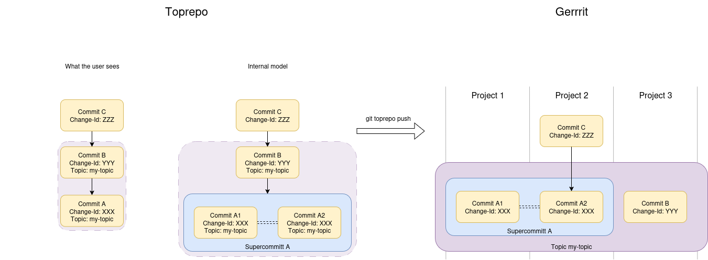

# git-toprepo - Monorepo when your company won't let you

The `git-toprepo` tool acts like an automatic client side [`git-subtree`]
based on the submodules in a top repository.
It will combine the history of all the repositories
and expand the content of the submodules
to create an emulated [monorepo].

Below, the term _monorepo_ is used as an abbreviation of
a _git-toprepo emulated monorepo_. See also [terminology].

[`git-subtree`]: https://www.atlassian.com/git/tutorials/git-subtree
[monorepo]: https://monorepo.tools/
[terminology]: doc/terminology.md

## Installation

Download a prebuilt binary from the [release page].

[release page]: https://github.com/meroton/git-toprepo/releases

## Getting started

`git toprepo clone <repository> [<directory>]` will clone `repository` into `directory` and
replace the submodule pointers with the actual content in the repository history.
If a `.gittoprepo.toml` configuration file is missing,
use `git toprepo config bootstrap` afterwards to create one.

`git toprepo fetch [<remote>]` fetches from a `remote` and performs the submodule expansion.

`git toprepo push [-n/--dry-run] <remote> <rev>:<ref> ...` does a submodule split
so that each submodule is pushed to its respective upstream repository.
If running with `-n` or `--dry-run`, the resulting `git push` command lines
will be printed but not executed.

### Replaced Git commands

When using git-toprepo, commands interacting with a remote server are wrapped,
operations acting on the local git repository stay the same.

| Regular git                    | git-toprepo                                                     |
| ------------------------------ | --------------------------------------------------------------- |
| `git init`                     | `git toprepo init`                                              |
| `git clone`                    | `git toprepo clone`                                             |
| `git fetch`                    | `git toprepo fetch`[*](#git-toprepo-fetch)                      |
| `git push`                     | `git toprepo push`[*](#git-toprepo-push)                        |
| `git pull`                     | `git toprepo fetch && git rebase/merge`[*](#branch-tracking)    |
| `git checkout origin/<branch>` | `git checkout origin/<branch>`                                  |
| `git checkout <branch>`        | `git checkout -b <branch> origin/<branch>`[*](#branch-tracking) |
| `git merge`                    | `git merge`                                                     |
| `git rebase`                   | `git rebase`                                                    |
| `git submodule`                | `git submodule`[*](#git-submodule)                              |
| `git <command>`                | `git <command>`                                                 |

TIP: For simplification, command lines like
`git fetch URL REF && git cherry-pick FETCH_HEAD` can be inserted right after
`git toprepo` and have the extra `git` ignored, for example
`git toprepo git fetch URL REF && git cherry-pick FETCH_HEAD`.
This is useful when copying commands straight from code review systems like
Gerrit, GitHub or GitLab.

#### git toprepo fetch
`git toprepo fetch` is basically a replacement of
`git fetch && git toprepo recombine`.

`git toprepo fetch REMOTE REF` will fetch the ref into
`refs/namespaces/NAME/refs/...` and then expand it into a suitable place in the
history of HEAD. This process will fail if a submodule commit is fetched but
there is no ancestor that have been expanded into a monocommit.

#### git toprepo push
`git toprepo push` splits the commits and runs `git push` towards each needed
remote repository. If the monocommit spans multiple repositories, git-toprepo
adds the push option `topic=` according to the `Topic:` written in the commit
message footer.

When amending a commit, the committer date changes, but the content to be pushed
might stay the same for some target repositories. To avoid pushing commits where
only the committer date has changed, git-toprepo tries to reuse previously
pushed commits that contain the same content. Unfortunately, this also means
that Gerrit complains when pushing an old patch-set again.

#### Branch tracking
Because git-toprepo needs to expand the commits after the fetch into
monocommits, `git pull` does not work. Plese use `git toprepo fetch` followed by
`git rebase` or `git merge` instead.

git-toprepo sets the git config `checkout.guess=false` to avoid accidental
branch tracking `git checkout <branch>`, use
`git checkout -b <branch> origin/<branch>` instead. All other `git checkout`
usage works as for a normal git repository. (Git's guess is that you want to
track the non-expanded topcommits, not the monocommits.)

#### git submodule
The git-toprepo configuration might state that some submodules should not be
expanded. In those cases, use `git submodule` as you would normally do.

## Documentation and presentations

Detailed documentation is located in the [`doc/`](doc/) folder.
The presentations below might also useful.

* 2025-10-19 [Gerrit Summit 2025](https://gerrit.googlesource.com/summit/2025/+/refs/heads/master/index.md):
  _Monorepo when your company won't let you_
  ([video](https://www.youtube.com/watch?v=2fZqdkNamMM),
  [slides](https://docs.google.com/presentation/d/1_rkB04jxcaYA1pb-NXFOEgQC0TKHGBemYIrUb-AKCF4))

## History combination strategy

The basic idea is to combine all the history from all the subrepositories
in a reproducible way. This means that even if users keep the emulated monorepository
locally on their own computers, they can still share monocommit hashes with everyone else.

Consider the following history and commits:

    Top repo  A---B---C---D-------E---F---G---H
                  |       |       |       |
    Submodule 1---2-------3---4---5---6---7---8

The combined history will look like:

    Monorepo  A---B2---C2---D3--E5---F5--G7--H7
                  /          \  /     \  / \
                 1            D4       F6   G8

... and NOT like:

    BAD REPO  A--B2--C2--D3--D4--E5--F5--G7--H7
                 /\      /         \    /     \
                1  ------            E6       H8

The algorithm steps are:
* Any submodule history before the submodule is added to the top repository,
  contains the original submodule commits (`1---B2`).
* Empty edges for the submodule history are removed (`2---3`).
  Such empty edges would only pollute the graph.
  The monorepo history for the submodule directory would
  show there is no update between the two commits anyway.
* The top repo will keep the "first parent" line (`D3---E5`).
  D4 might not be buildable and would break
  `git bisect --first-parent`.
* Submodule changes are moved as late as possible before erging (`F6`).
  The alternative of `E6` instead of `F6` clutters the `git log --graph` view.
  From the top repo view, it is anyway impossible to know if `E6` or `F6`
  is better (buildable) or not.
* Unmerged submodule branches are branched as early as possible.
  It is easier to run `git checkout G8 && git rebase H7` than
  `git checkout H8 && git rebase H7 --onto G7`.
* `FETCH_HEAD` from submodules are branched from the history of `HEAD`.
  As commit `7` can be used in multiple top repo branches,
  it is impossible to know which branch commit `8` is aimed for.
  Simply checkout a different monorepo branch and run `git toprepo fetch`
  to expand an unmerged submodule onto a different line of history.

## Configuration

By default, the git-toprepo configuration is read from the committed `HEAD` in the remote toprepo,
i.e. `should:refs/namespaces/top/refs/remotes/origin/HEAD:.gittoprepo.toml`,
but prioritizes `may:worktree:.gittoprepo.user.toml` if it exists.

The configuration is specified in [Toml](https://toml.io/) format.

### Configuration location

The location of the configuration file is set in the `git-config` of the
emulated mono repository using `git config --local toprepo.config <location>`
and takes the following forms:

* `(may|should|must):repo:<ref>:<path>`, a path in the tree of git ref,
* `(may|should|must):local:<path>`, a file relative to the main worktree, and
* `(may|should|must):worktree:<path>`, a file relative to the current worktree.

The last exising location specified in `git config --get-all toprepo.config` is used.

The first keyword of the location specification describes the enforcement level,
similarily to [IETF RFC 2119](https://www.ietf.org/rfc/rfc2119.txt):
* `may`, warn if this configuration exists,
* `should`, warn if this configuration is missing,
* `must`, error if this configuration is missing and stop the search, which is
  useful to avoid falling back from local to global git configuration.


### Sub repositories

As `.gitmodules` evolves on the branches over time and
the servers might be relocated, the repository configuration shows how to
access each sub repository in the full history of the top repository.
For example, multiple URLs might have been configured in
the `.gitmodules` file, but all of them refers to the same repository.

Each submodule is fetched using
`git fetch --prune <url> +refs/heads/*:refs/namespaces/<repo-name>/heads/* +refs/tags/*:refs/namespaces/<repo-name>/tags/*`.
This makes sure that all referenced commit ids that are reachable from heads
and tags in the upstream submodule will be expanded.

After each run of `git toprepo fetch`, the actually resolved configuration is
written to `.git/toprepo/last-effective-git-toprepo.toml`. This file includes
suggested `[repo.*]` additions to the `.gittoprepo.toml` configuration.

```
[repo.something]
urls = [
    "https://github.com/meroton/git-toprepo.git",
    "server.example/git-toprepo.git",
]
# Keep as a regular submodule when set to false.
enabled = true

fetch.url = "ssh://git@github.com/meroton/git-toprepo.git"
# Affects the --prune fetch arg, defaults to true.
fetch.prune = true
# --depth is added if set to non-zero.
fetch.depth = 0

# Commit ids that should not be expanded because they are permanently missing
# from the repository.
missing_commits = []

[repo.something.push]
# push.url defaults to fetch.url.
url = "ssh://git@github.com/meroton/git-toprepo.git"
args = []
```

## Git configuration

A strong recommendation is to use the same branch name in all involved
repositories. The fetch code will work with any branch names,
but it quickly becomes very confusing which branch is which,
and `git-toprepo push` currently assumes that the same branch name
is used in all repositories. If you do have a mix of branch names,
use `git-toprepo push --dry-run` and push manually to the correct branches.

### Gerrit Code Review

The following steps are required to operate a git-toprepo emulated monorepo.

* Create a toprepo, in the example called "my-only-toprepo".
* Enable [`config.submitWholeTopic`] to allow [submitting changes across
  repositories by using topics].
* Updating the project configuration, e.g. in
  `All-Projects.git:refs/meta/config`, to allow [superproject subscription to
  submodules updates]:
```
    [allowSuperproject "my-only-toprepo"]
        matching = refs/heads/*:refs/heads/*
```
* [Track `branch = .`] for all submodules in `.gitmodules` on all branches in
  the toprepo. This will make the super projects follow the same branch name as itself.

[`config.submitWholeTopic`]:
    https://gerrit-review.googlesource.com/Documentation/config-gerrit.html#change.submitWholeTopic
[submitting changes across repositories by using topics]:
    https://gerrit-review.googlesource.com/Documentation/cross-repository-changes.html
[superproject subscription to submodules updates]:
    https://gerrit-review.googlesource.com/Documentation/user-submodules.html
[Track `branch = .`]:
    https://git-scm.com/docs/gitmodules#Documentation/gitmodules.txt-submodulenamebranch

### GitHub Code Review

Support for review in GitHub is not implemented.

### GitLab Code Review

Support for review in GitLab is not implemented.

## Concepts

The following section describes the data model and the concepts involved in
working with git-toprepo. This has primarily been developed from available
server side features in the [Gerrit Code Review] system but is not restricted to
it. (Gerrit happens to be the authors' preferred review tool.)

The terminology used here often borrows from [Gerrit] and [Zuul CI].

> [!NOTE]  Some of the functionality is not yet released.

[Gerrit Code Review]: https://www.gerritcodereview.com/
[Gerrit]: https://www.gerritcodereview.com/
[Zuul CI]: https://zuulci.org/

### Commits, topics and monocommits

Let's define a _topic_ as changes to be merged together in multiple
repositories, like Gerrit does. A topic may be cover multiple monocommits where
a monocommit contains commits within projects
those projects are combined into a monorepo
through git-toprepo's history combination.

A picture is worth a thousand words:



This shows a purple topic that contains two monocommits: `A` and `B`.
The `A` monocommit spans two projects
and the internal model keeps track of them individually.
Git-toprepo then pushes the _four_ commits to Gerrit
and tracks `A1`, `A2` and `B` as one topic.
Because Gerrit only tracks dependencies (git's parent relationship)
within a project `C` is now shown to have `A2` as its parent,
 `B` is not visible to `C` after the push within its project
instead the `C -> B` dependency is handled through the topic.
We will dig deeper into this later
and cover how to go from right-to-left
to download open changes from Gerrit with git-toprepo.

#### Backend support

Gerrit is currently the only backend that supports submitting multiple changes
together. Therefore, git-toprepo only has support for querying Gerrit about
topic information. PRs for extending to other backends like GitHub and GitLab
are welcome.

🚧 Gerrit topic integration is coming soon.
https://github.com/meroton/git-toprepo/issues/121

### Subprojects and Submodules

We prefer to talk about the repositories in Gerrit as projects,
as that does not denote whether they are combined into the monorepo history
or are tracked as regular git-submodules.
It is common for a monorepo to eschew combining some subprojects into the shared history,
if they are very large and not actively developed, for instance.

#### Commits

Commits are the bedrock of working with git.
These are created in the individual _subprojects_ or _submodules_
but multiple commits across different subprojects can form one coherent _monocommit_.
To form these is git-toprepo's core purpose,
to make cross-cutting changes across subprojects handled as individual commits
during development and in the combined history.

#### Monocommits

Monocommits is what we call commits created in the emulated monorepo
either from the combined history,
where merges from the review system are bunched into one atomic unit,
or on-going work that may span multiple subprojects.
It is not so simple that a monocommit is always a Gerrit topic,
though that is often the case when using Gerrit for code review.
A topic in Gerrit may under certain circumstances be merged with additional commits
that were (or were not) reviewed to be merged together.
As the review system owns the canonical git history
we follow its merge flow
(autobump commits, submit-whole-topic, etc).

Monocommits are fundamentally a client-side construct.
They are created either when committing new work with `git-commit`,
after fetching new history from the remote,
or by fetching on-going work from a colleague.
In the latter case there is no way to know precisely her working state
before she pushed to Gerrit
as we have no way to communicate that.
There is, however, a simple convention that helps users collaborate.
We will go through that in the example and collaboration sections.

🚧 Gerrit topic integration is coming soon. https://github.com/meroton/git-toprepo/issues/121

##### Merged or unmerged

It is natural to make the distinction between merged and unmerged commits
but it is better to have consistent behavior.
The goal here is to try to thread that needle
and communicate the subtleties of large scale collaboration.

The merged history is always the simplest:
whatever was submitted together is one monocommit,
or a single commit if it was submitted independently,
though with __manual submission__ there are __rare exceptions__.
So the split of one topic into multiple monocommits is not performed
in the filtered history.

Recall that a commit may be merged to the development branch
but still be in-review for a release branch.
Then the filtered history on the client-side contains
both merged commits (master branch) and unmerged (development branch).
The developer may want to treat a given topic as multiple monocommits
during review for the development branch
but they are originally one monocommit when fetched from master.

#### Collaboration

There is a simple, not mandatory, convention to communicate the monocommits
meant to form a topic in Gerrit:

* Use the same commit message and change-id

When a developer fetches the topic with git-toprepo,
the [`recreate`] strategy can be used to recreate the original working state.
If the individual commits in the topic were not created with git-toprepo,
it is unlikely that they
would have the same change-id.
In that case, the choice of [fetch strategy] is
less clear.
To recreate monocommits means to treat each commit as their own
monocommit,
allowing the developer to squash them manually after the fetch.
Instead, to squash the topic into one monocommit
there are two other options:

* _squash-if-possible_: squash the topic into a single monocommit if it is possible.
    If there are multiple commits within a project this will instead give an error
    and the user will need to decide how to proceed.
* _force-squash_: squash the entire topic into a single monocommit.
    If there were multiple commits within a project their provenance will be tracked
    within the squashed commit message.
    But it is no longer possible to push changes to the original commits in Gerrit.

<!-- TODO: This first describes the good strategy, then explains the others in a list. -->
<!--       Do we want the list to include all of them? -->

🚧 Gerrit topic integration is coming soon. https://github.com/meroton/git-toprepo/issues/121

#### Topic

We use the [topic concept] from [Gerrit],
the only platform that has custom integration in `git-toprepo`.
The topic is a way to indicate that many commits should be _merged_ together.
That means that all of the commits in a topic should be submitted as one atomic unit
to the history.
As the review platform is the canonical history
one merged topic will create one monocommit in the recombined history of the top repository.

🚧 Gerrit topic integration is coming soon. https://github.com/meroton/git-toprepo/issues/121

[topic concept]:
    https://gerrit-review.googlesource.com/Documentation/intro-user.html#topics

### Commit messages and footers

The commit message for the merged monocommits is composed by all the contained
individual commit messages. Commit messages existing in multiple subrepo are
deduplicated and automatic messages like `Update git modules` are removed.

The format is not guaranteed to be stable
but the information contained is meant to reflect constituents:

* Commits in which subprojects
* Their individual commit messages

🚧 Topic information is taken from Gerrit
and is reflected in this message.

#### Zuul CI's dependency footers

Zuul CI has a dependency indication through [`Depends-On` footers]
where a commit can specify that it should be gated together with other commits.

🚧 Zuul depends-on integration is coming soon.
https://github.com/meroton/git-toprepo/issues/122

[`Depends-On` footers]:
    https://zuul-ci.org/docs/zuul/latest/gating.html#cross-project-dependencies

#### Git-toprepo footers

On the client side, a few commit message footers are used. They are removed when
splitting mono commits, before pushing to any remote.

* `Topic: \<global-name\>` can be used to create a topic for one or multiple monocommits.
  This will not be pushed in the commit to the Gerrit backend.
  Other review system backends,
  when they are implemented,
  may need to keep this footer.

  The topic footer is also be written back during when combining the git
  histories.
* `Git-Toprepo-Ref: <path> <commit-id>` is added to be able to reconstruct the
  individual subrepo commits. Users also benefit in `git log` from being able to
  find out which the individual upstream commit ids.
